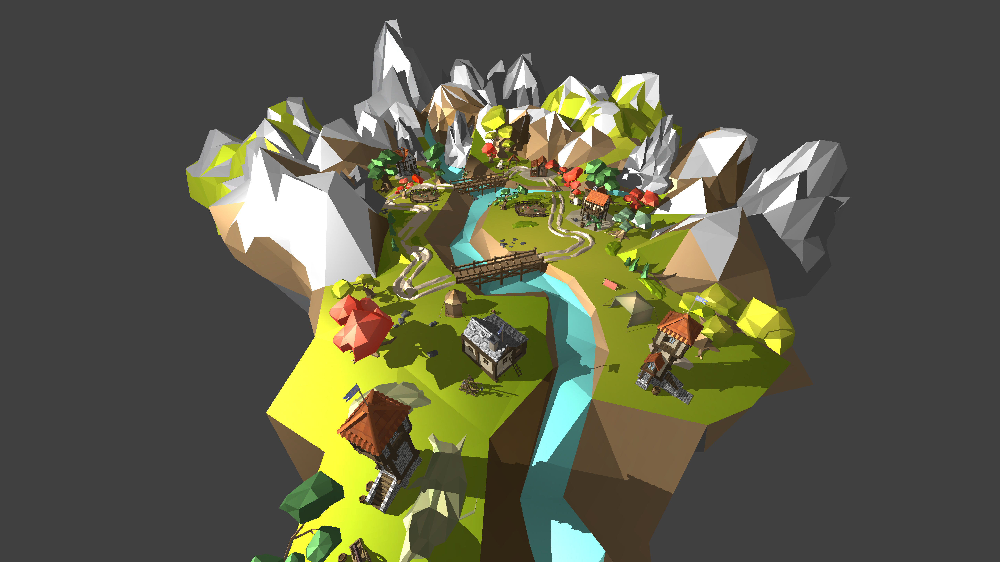
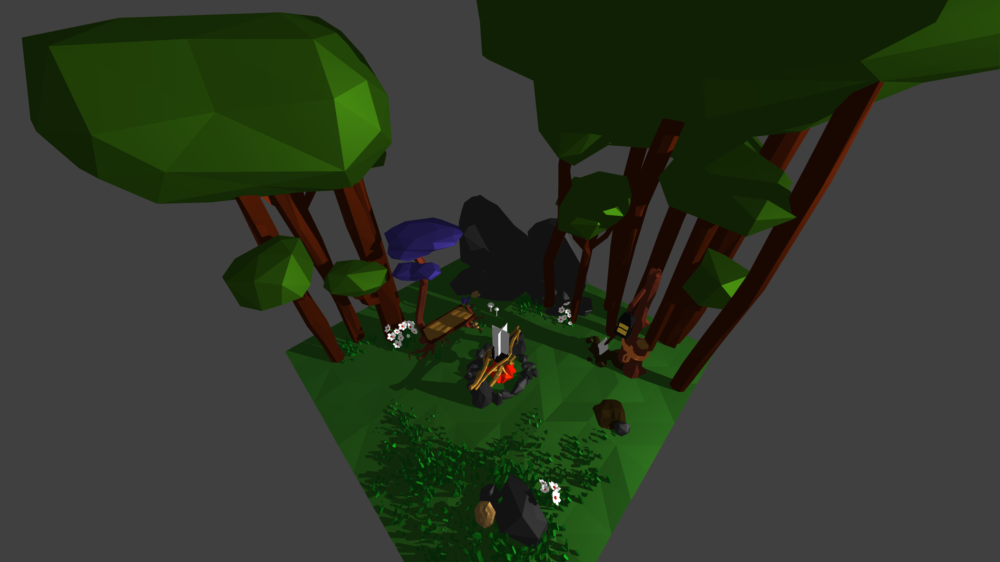

# Rasterizer

This is a basic implementaion of a software 3D renderer. It supports loading .obj files, shadow rendering, multithreaded rendering, and more!

Here are some examples of what is possible with this project:





# Operation

The binary takes three command line arguments:
- path to the config file
- (optionally) path to obj/mtl
- output filename

The config file must have an extension of .txt and provides a multitude of ways you can change the way your render comes out (lighting, positioning, shadows, etc.), as well the ability to define individual triangles with an intuitive format. If you provide the binary with an obj file, the object data will be loaded from that, disregarding any triangles you entered in the config file.

Ex: ./rasterizer.exe object config out

# Configuration

The config file is laid out like so (not including the stuff in curly braces following each option):

```
width = u32 {Width in pixels of the output image}
height = u32 {Height in pixels of the output image}
clear_color = [u8, u8, u8] {What pixels should be colored if no triangle is present to be rendered there}
legacy = bool {If true, disregard all of the following options and only render triangles defined in this file}
color_freq = f64 {Determines the frequency with which vertex colors change across an object (vertex colors are only used when no other method of coloring is available)}
shade_mode = u32 {Used when coloring vertices when no other coloring option is available (like the above option). 0 = each vertex of a triangle gets the same color, 1 = each vertex of a triangle gets a unique color, 2 = a weird hybrid of 0 and 1}
fov = f64 {Viewing angle on the y-axis}
n = f64 {Near clipping plane (anything closer to the camera will not be rendered)}
f = f64 {Far clipping plane (anything farther from the camera will not be rendered)}
scale = f64 {By how much to scale every vertex in the scene (Ex: 2.0 = twice as big, 0.5 = half as big)}
rot_x = f64 {By how much to rotate every vertex in the scene about the x axis, applied third}
rot_y = f64 {By how much to rotate every vertex in the scene about the y axis, applied second}
rot_z = f64 {By how much to rotate every vertex in the scene about the z axis, applied first}
trans_x = f64 {By how much to translate every vertex in the scene along the x axis}
trans_y = f64 {By how much to translate every vertex in the scene along the y axis}
trans_z = f64 {By how much to translate every vertex in the scene along the z axis}
light_pos = [f64, f64, f64] {Position of the light source}
ambient = f64 {Ambient lighting strength}
diffuse = f64 {Diffuse lighting strength}
specular = f64 {Specular lighting strength}
shininess = u32 {Specular shininess}
render_shadows: bool {If true, shadows will be rendered. (WARNING: They are super slow)}
tex_sample_lerp: bool {If true, pixels will interpolate between the nearest texels on the texture}
render_threads: u32 {Number of threads to render across}
show_progress: bool {If true, Print progess information while rendering}
```

Then, with newlines as separators, triangles can be defined like so (not including the stuff in curly braces following each option):

```
a = [f64, f64, f64] {Position of the first vertex in the triangle}
b = [f64, f64, f64] {Position of the second vertex in the triangle}
c = [f64, f64, f64] {Position of the third vertex in the triangle}
color_a = [u8, u8, u8] {Color of the first vertex in the triangle}
color_a = [u8, u8, u8] {Color of the second vertex in the triangle}
color_a = [u8, u8, u8] {Color of the third vertex in the triangle}
```